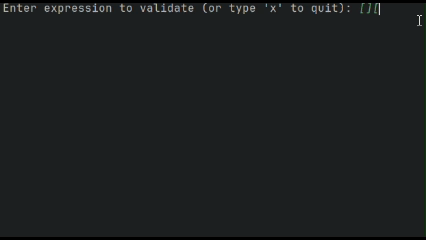

# 🧩 ParenthesisValidator (Java)

This project implements a **parentheses, brackets, and braces validator** using the **Stack** (LIFO) data structure in Java.

## 🚀 Features

* ✅ Checks if parentheses `()`, brackets `[]`, and braces `{}` are balanced.
* 🔍 Ignores any other characters in the input string.
* 📍 Reports the **exact index** of the first error encountered:

    * Closing without a matching opening.
    * Mismatch between opening and closing symbols.
    * Opening without a corresponding closing.
* 🔄 Interactive mode: validate multiple expressions until the user types `'x'` or presses **Enter** on an empty line.
* 📋 Built-in test cases for common validation scenarios.

## 📁 Project Structure

```
ParenthesisValidator/
├── src/
│   └── ParenthesisValidator.java
├── assets/
│   └── demo.gif       # Demonstration GIF of the program in action
└── README.md          # This file
```

## 🎬 Demo



## 💻 How to Use

1. **Compile and run**:

   ```bash
   javac src/ParenthesisValidator.java
   java src.ParenthesisValidator
   ```
2. The program will display automatic test results on startup.
3. In interactive mode, enter expressions to validate or type `'x'`/press **Enter** on an empty line to exit.

### 📋 Example Inputs

```text
()[]{}       → ✅ Balanced
([)]         → ❌ Not balanced (mismatch)
(            → ❌ Not balanced (unclosed)
```

## 🛠️ Tech Stack

* **Java 17+**
* `java.util.Stack`
* `java.util.Scanner`

## 🎯 Next Steps

* Add support for reporting **maximum nesting depth**.
* Validate expressions containing **operators and literals**.
* Implement a **web version** (e.g., Spring Boot + Vue.js) to test expressions in a browser.

---

**Author:** Alexandre Gaia
**Date:** August 2025
